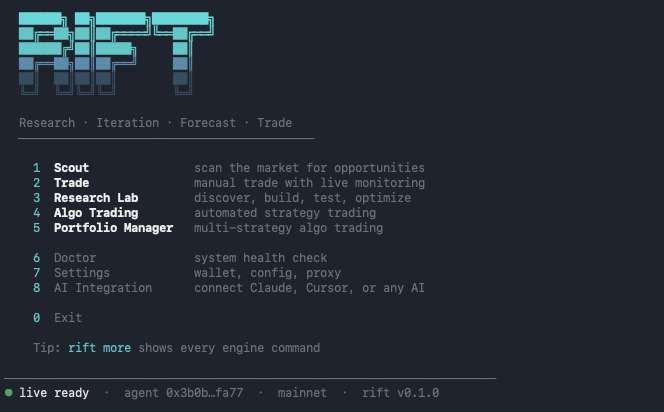

# RIFT

<p align="center">
  
</p>

**Quant Trading Infrastructure for Humans and AI.** Research, validate, and deploy systematic trading strategies on Hyperliquid (HL) perps. Published by Nexstone.

> ⚠️ **RIFT is software, not financial advice.** Trading perpetual futures involves substantial risk of loss including the total loss of deposited capital. Past backtest performance does not predict future returns — markets drift, regimes change, models decay. RIFT ships with safety primitives (kill switches, drawdown limits, signed auth tokens, on-chain audit trail) but no software eliminates market risk. Never trade more than you can afford to lose, and never deploy a strategy you don't personally understand. The one strategy that ships (`trend_follow`) is an explicitly demo-only EMA crossover — see its docstring.

RIFT is built for two audiences in one tool:

- **Quant-curious traders** — tired of trading on gut. Want statistical backing for every decision but don't necessarily write Python. Use the workbench, CLI, or MCP-driven AI assistant.
- **Top-tier quants** — write Python directly against substrate primitives. Compose factor models, Kelly sizing, deflated Sharpe checks, alpha-decay measurement, and walk-forward validation without leaving the framework.

The same engine that powers the CLI also powers an MCP server, so Claude / other AI agents can drive the entire research-to-trade flow locally.

---

## What RIFT does

- Backtest on real Hyperliquid candle, funding, and L2 order-book data
- Validate with purged k-fold CV, walk-forward, Monte Carlo, deflated Sharpe ratio
- Measure capacity (impact + ADV + L2-depth), alpha decay (half-life), cross-impact for baskets
- Promote / reject strategies through configurable gates (DSR, CV pass rate, drawdown, track record, capacity)
- Seal every result with content-addressed reproducibility manifests
- Execute live on HL with auth-token capability tiers, kill switches, audit trail
- Portfolio supervision: coordinate risk across multiple algo strategies
- One reference strategy (`trend_follow`) ships as a worked example that passes the framework's own promotion gates

---

## Architecture

Three interfaces over five core engine layers, with auxiliary packages composed on top:

```
                                ┌──────────────────────────┐
   AI agents (Claude, etc.) ───>│  MCP server (rift serve) │ ─┐
                                └──────────────────────────┘  │
                                                              │
   Terminal users  ────────────>┌──────────────────────────┐  │
                                │  CLI (rift <command>)    │ ─┤  same Python
                                └──────────────────────────┘  │  engine + data
                                                              │
   Python power users ─────────>┌──────────────────────────┐  │
                                │  Python (import rift_*)  │ ─┘
                                └──────────────────────────┘
                                ┌──────────────────────────────────────┐
                                │ research — pipeline orchestrator     │
                                ├──────────────────────────────────────┤
                                │ engine — backtest / WF / MC / sweep  │
                                ├──────────────────────────────────────┤
                                │ trade — auth / propose / execute     │
                                ├──────────────────────────────────────┤
                                │ substrate — math primitives          │
                                │   (frictions, stats, validation,     │
                                │    decay, capacity, regime, etc.)    │
                                ├──────────────────────────────────────┤
                                │ data — HL S3 + REST + local cache    │
                                └──────────────────────────────────────┘
```

Three interfaces (CLI / Python / MCP), one engine. The diagram shows the five core engine layers (data → substrate → engine + trade → research); `portfolio`, `strategies-sdk`, `api`, and `core` compose on top. Whatever the CLI can do, the Python API and the MCP server can also do. Strategies are written once and run from any of the three.

---

## Install

Requires:
- **[`uv`](https://docs.astral.sh/uv/)** for Python (will auto-install Python 3.13 if your system doesn't have it)
- **Node 20+** and **[`pnpm`](https://pnpm.io/)** for the CLI

```bash
# Clone
git clone <repo-url> rift
cd rift

# Python deps via uv (installs Python 3.13 + all workspace packages editable)
cd engine && uv sync && cd ..

# CLI deps via pnpm
pnpm install
cd packages/cli && pnpm build && cd ../..

# Configure secrets (AWS for S3 sync + optional HL wallet for live trading)
mkdir -p ~/.rift && cp .env.example ~/.rift/.env
# Edit ~/.rift/.env with your AWS access key + secret (free tier sufficient)

# Make the CLI binary callable as `rift` (one-time, optional but recommended)
# Pick one:
#   - Add the bin dir to PATH:
#       export PATH="$PWD/packages/cli/bin:$PATH"
#       (add to ~/.zshrc or ~/.bashrc to persist)
#   - Or symlink into ~/bin (or any dir already on your PATH):
#       ln -s "$PWD/packages/cli/bin/run.js" ~/bin/rift
```

You now have:
- `rift` (CLI) callable via `packages/cli/bin/run.js` — symlink or add to PATH (see above) for the bare `rift` shorthand
- `rift-engine` Python entry point at `engine/.venv/bin/rift-engine`
- 9 `rift_*` Python packages available via `import` (`rift_core`, `rift_data`, `rift_substrate`, `rift_engine`, `rift_trade`, `rift_research`, `rift_portfolio`, `rift_strategies_sdk`, `rift_api`)
- `rift serve` starts the MCP server (59 tools)

---

## Quickstart — 60 seconds

```bash
# 1. Sync the last 90 days of BTC data from Hyperliquid S3 archive
#    (optional — the backtester will auto-fetch from the HL REST API on demand
#     if you don't sync first; sync gives you faster local backtests)
rift sync --coins BTC --tf 1h,4h

# 2. Run the full research pipeline on the bundled OSS reference strategy
rift research trend_follow --pair BTC --tf 4h
```

You will see the framework execute: backtest → walk-forward → Monte Carlo → multi-pair → feature importance → volatility forecast → health check → purged CV → alpha decay → capacity → promotion verdict → sealed reproducibility bundle.

On BTC 4h with default params **against the full 2-year archive** (`rift sync` first), `trend_follow` returns +25.0% / Sharpe 0.71 / -6.88% max DD, passes 5 of 5 promotion gates. Without sync, the auto-fetched ~10-month window will show different numbers — backtest results are window-dependent, and the framework reports honestly on whatever window you give it. The verdict is reproducible; the numbers depend on the data window.

---

## Layer-by-layer overview

| Layer | Package | What it does |
|---|---|---|
| Core | `rift_core` | Shared types, config, schema, key management, NDJSON output protocol — the substrate the other Python packages share |
| Data | `rift_data` | HL S3 + REST sync, candle / funding / OI / L2-book loaders, local parquet cache |
| Substrate | `rift_substrate` | Math primitives — frictions, stats, validation (purged CV), regime (HMM), decay, capacity, cross-impact, promotion gates, sealed bundles |
| Engine | `rift_engine` | Backtest (vectorized + event-driven), walk-forward, Monte Carlo, parameter sweep, Bayesian smart-optimize, signal indicators, strategy base class, TCA, attribution |
| Trade | `rift_trade` | Capability-tiered auth (T0/T1/T2/T3), order proposal, signed execution, kill switches, position recon, websocket lifecycle |
| Research | `rift_research` | `run_research_pipeline()` chains data → backtest → WF/MC → advanced validations → sealed bundle |
| Portfolio | `rift_portfolio` | Multi-strategy supervisor: correlation guard, VaR, pair trades, daemon coordination |
| API | `rift_api` | HTTP REST API server exposing state files for institutional dashboards and PMS integrations |
| Strategies SDK | `rift_strategies_sdk` | Scaffold (`rift new <name>`) + the `trend_follow` reference strategy |
| CLI | `@nexstone/rift-cli` (TS) | 40+ commands, oclif-based, spawns Python engine via subprocess |
| MCP | (in CLI) | 59 MCP tools wrapping the same engine via `rift serve` — for AI agent integration |

---

## Three usage patterns

**1. From the terminal:**

```bash
rift research trend_follow BTC 4h            # full pipeline
rift backtest trend_follow --pair BTC --tf 4h # just the backtest
rift sweep trend_follow --pair BTC --tf 4h    # parameter sweep
rift new my_strategy                          # scaffold a new strategy
```

**2. From Python:**

```python
from rift_research.research import run_research_pipeline

result = run_research_pipeline("trend_follow", pair="BTC", interval="4h")
print(result["promotion_verdict"])   # 5/5 gates, PASS
```

**3. From an AI agent (Claude Desktop / Claude Code / etc.):**

Configure your AI client to launch RIFT's MCP server:
```json
{
  "mcpServers": {
    "rift": { "command": "rift", "args": ["serve"] }
  }
}
```

The AI now has access to 59 tools — backtest, walk-forward, sweep, scout, manual_trade, portfolio_start, audit_export, etc. Everything runs locally on your machine.

---

## Vision principles

A few you should know before working in the codebase:

1. **Frequency-agnostic** — works on tick → 1m → 1h → 1d → 1w. No bar size baked into the math.
2. **Style-agnostic** — HFT MM, stat arb, momentum, carry, swing — all first-class.
3. **Strategy-agnostic core** — the engine does not know what strategy is running. Every promotion gate, every analytic phase, runs on any strategy.
4. **HL-only forever** — Hyperliquid is the single venue; no multi-exchange abstraction.
5. **OSS ships everything except data and strategies** — no tier gating, no feature flags.
6. **Build it right the first time** — no MVP / phase-N / "for now" framing in the code.
7. **Top-quant rigor is the ceiling, not the floor** — Renaissance-grade math runs underneath a Lightroom-grade interface.

The complete principle list lives in `RELEASE.md`.

---

## Documentation

Start here:
- [`docs/QUICKSTART.md`](docs/QUICKSTART.md) — 10 minutes from clone to your first sealed research bundle
- [`docs/INSTALL.md`](docs/INSTALL.md) — full install instructions for macOS, Linux, WSL2

Using RIFT:
- [`docs/strategies/AUTHORING.md`](docs/strategies/AUTHORING.md) — write a strategy from scratch with the SDK
- [`docs/signals/AUTHORING.md`](docs/signals/AUTHORING.md) — add your own custom scout signals
- [`docs/research/METHODOLOGY.md`](docs/research/METHODOLOGY.md) — what walk-forward / Monte Carlo / purged CV / DSR / alpha decay actually do
- [`docs/mcp/SETUP.md`](docs/mcp/SETUP.md) — wire RIFT into Claude Desktop / Claude Code / Cursor as an MCP server
- [`docs/CLI_REFERENCE.md`](docs/CLI_REFERENCE.md) — every command, every flag (auto-generated from `--help`)

Technical references:
- [`docs/AUTH_AND_EXECUTION.md`](docs/AUTH_AND_EXECUTION.md) — three-layer key model, capability tiers, audit substrate
- [`docs/BACKUP_AND_STATE.md`](docs/BACKUP_AND_STATE.md) — what's in `~/.rift/`, what to back up, how to move installs
- [`docs/RUNBOOK_ALGO_MONITORING.md`](docs/RUNBOOK_ALGO_MONITORING.md) — daily / weekly checks for a long-running algo daemon
- [`engine/SIGNALS.md`](engine/SIGNALS.md) — indicator + signal reference (38 signals across 9 categories)

Project-level:
- [`CHANGELOG.md`](CHANGELOG.md) — what changed in each release
- [`KNOWN_ISSUES.md`](KNOWN_ISSUES.md) — current limitations and sharp edges
- [`PRIVACY.md`](PRIVACY.md) — what data leaves your machine (spoiler: only Hyperliquid + AWS S3)
- [`SECURITY.md`](SECURITY.md) — how to report vulnerabilities
- [`CONTRIBUTING.md`](CONTRIBUTING.md) — dev setup, branch model, PR conventions
- [`CODE_OF_CONDUCT.md`](CODE_OF_CONDUCT.md) — community expectations
- [`RELEASE.md`](RELEASE.md) — release procedure and pre-release checklist

---

## Contributing

This is an OSS project published by Nexstone. See [`CONTRIBUTING.md`](CONTRIBUTING.md) for the full guide. Quick reference:

```bash
# Run the full test suite
uv run --project engine pytest

# Run only fast tests (skips ones that need synced data)
uv run --project engine pytest -m "not slow and not mainnet"

# Build the TS CLI
cd packages/cli && pnpm build
```

Before opening a PR:
- All tests pass: `pytest -m "not slow"` returns 0
- New strategies have a `promotion_gates` config that honestly reflects what the strategy is (a slow trend-follower should declare `min_trades=25`, not lie about being institutional)
- New substrate primitives include unit tests in the same package

---

## License

See `LICENSE` at repo root.
